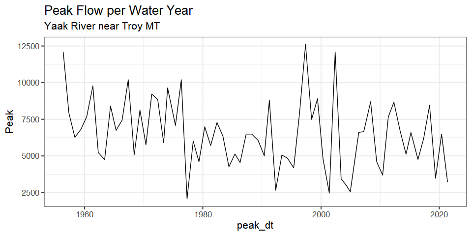

<!-- README.md is generated from README.Rmd. Please edit that file -->

# wildlandhydRo

<!-- badges: start -->

<!-- badges: end -->

The goal of wildlandhydRo is to create wrapper functions around commonly
used packages like [streamstats](https://github.com/markwh/streamstats),
[snotelr](https://github.com/bluegreen-labs/snotelr) and
[dataRetrieval](https://github.com/USGS-R/dataRetrieval). Basically, a
package for me but worth sharing with others.

## Installation

You can install the development version from
[GitHub](https://github.com/) with:

``` r
# install.packages("devtools")
devtools::install_github("joshualerickson/wildlandhydRo")
```

## Example

This is a basic example which shows you how to solve a common problem:
getting more than one culvert sized.

``` r
library(wildlandhydRo)
## basic example code
```

This delineates the basins and then computes basin characteristics
(e.g. precip, basin area, percent forested, etc.). The advantage of
`batch_StreamStats()` is you can do more than one at a time. See example
below.

``` r
# data frame with 3 different pour point locations
data <- tibble(Lat = c(48.7151, 48.6995, 48.6955, 48.6898),
                  Lon = c(-115.0839, -115.0916, -115.0834, -115.0957),
                   Site = c("Pink Creek", "Sieminski Creek", "Finger Creek", "Lydia Creek"))

four_sites <- data %>% batch_StreamStats(lon = Lon, lat = Lat, group = Site,
                                  crs = 4326)
```

You can see that below that the basins were delineated. The function
adds basin characteristics, which we can then visualize,
e.g. precipitation.

 <br>

Now we can use `batch_RRE()` to get regional regression estimates. Here
we’ll use the `three_sites` named object as the parameter input for the
function. Note you don’t have to use a `batch_StreamStats()` object and
could just manually enter the correct parameters.

``` r
peak_RRE <- four_sites %>% batch_RRE(state = state, wkID = wkID, group = group)
```

Then we can plot together. Below are the three different sites and the
regional regression estimates (RRE) plotting for these pour points.

``` r
peak_RRE %>% ggplot(aes(parse_number(Name), Value)) + geom_line() + geom_point() + facet_wrap(~group, nrow = 1)
```



The next step is to generate recommended culvert sizes for a set of
reoccurrence intervals (e.g. 2,25,50,100) based on the stream stats
collected in the previous steps. It’s important to note that this is
only available for western Montana right now. Also, we don’t have
bankfull width measurements and it is highly recommended to include if
you can.

``` r
culverts_all <- batch_culverts(ss = four_sites, rre = peak_RRE)
```

Then we can plot and see the difference between regressions.

``` r
culverts_all %>% ggplot(aes(RI, value, color = source)) + geom_point() + geom_line() + geom_text_repel(data = culverts_all %>% group_by(group) %>% filter(RI == 100),aes(label = Size), force = 50) + facet_grid(group~Method)
```


